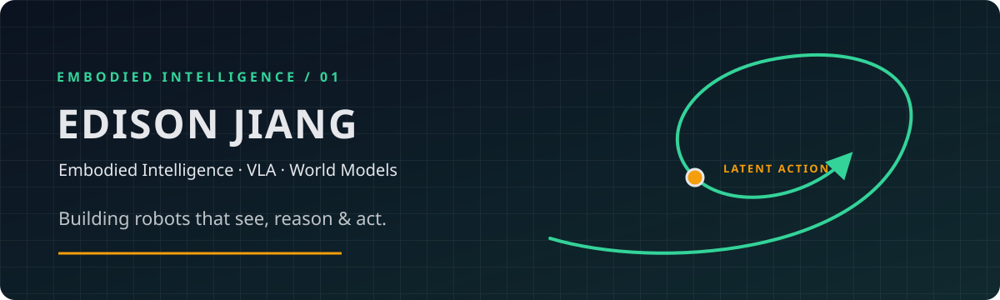
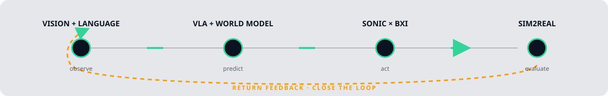

  

# Edison Jiang

Embodied intelligence researcher building robot systems that connect perception, language, planning, and whole-body action. I work at the boundary between learning-based policies and robot software for real-world experiments.

## Research loop

  

The loop starts with multimodal observation, turns models into robot actions, and uses simulation-to-real feedback to guide the next experiment.

`VISION + LANGUAGE` → `VLA + WORLD MODEL` → `SONIC × BXI` → `SIM2REAL`

## Currently building

- I am integrating Elf3 experiments with BXI and SONIC for embodied manipulation research.
- I am running garment-folding experiments that connect perception, control, and physical interaction.
- I am iterating on robot policies and evaluation across real hardware and simulation, documenting experiments so results can be revisited.

## Selected projects

<table>
  <tr>
    <td><a href="https://github.com/jiangmingxuan234-alt/bxi_controller_ros2"><strong>BXI Controller ROS 2</strong></a> ROS 2 control software for the BXI platform.</td>
    <td><a href="https://github.com/jiangmingxuan234-alt/com.bxi.sonic"><strong>SONIC</strong></a> A BXI-related robotics software project.</td>
  </tr>
  <tr>
    <td><a href="https://github.com/jiangmingxuan234-alt/Embodied-AI-Franka"><strong>Embodied-AI-Franka</strong></a> Embodied AI experiments with a Franka robot.</td>
    <td><a href="https://github.com/jiangmingxuan234-alt/uav-ugv-cooperative-system-sim-to-real"><strong>UAV–UGV Cooperative System</strong></a> Simulation-to-real work for cooperative aerial and ground robots.</td>
  </tr>
</table>

## Research interests

- **VLA:** vision-language-action models for grounded robot behavior.
- **World models:** predictive representations for planning and embodied reasoning.
- **Robot learning:** data-efficient policies that transfer to physical systems.
- **Whole-body control:** coordinated motion and contact-aware manipulation.
- **Sim2Real:** simulation, evaluation, and feedback loops that support real-robot deployment.

## Tools & systems

`Python` · `C++` · `ROS 2` · `Linux` · `PyTorch` · `Simulation`

## Notes

This profile is an evolving lab notebook: projects and experiments are linked above as the work develops.

## Contribution trail

  <picture>
    <source media="(prefers-color-scheme: dark)" srcset="assets/github-snake-dark.svg" />
    <source media="(prefers-color-scheme: light)" srcset="assets/github-snake.svg" />
    
  </picture>

## Contact

The best place to follow the work is the public project repositories on [GitHub](https://github.com/jiangmingxuan234-alt).

Embodied intelligence in the loop — observe, reason, act, learn.
